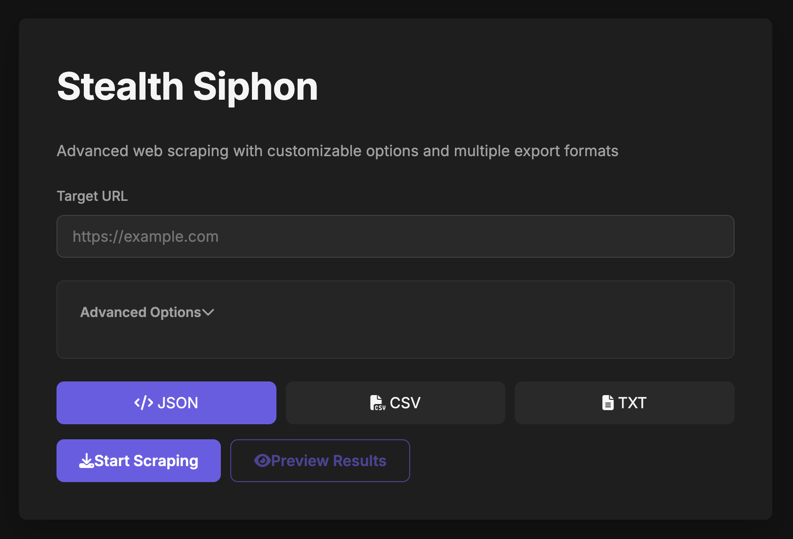

# Stealth Siphon

Advanced web scraping tool with built-in proxy server, headless browser integration, and automated scheduling capabilities.



## Created by Christopher Bradford

## Features

- **Client-Side Scraping**: Extract data directly in the browser
- **Multiple Export Formats**: Save as JSON, CSV, TXT, or HTML
- **Built-in Proxy Server**: No reliance on external CORS services
- **Headless Browser Integration**: Scrape JavaScript-rendered content with automatic fallback
- **Database Export**: Export scraped data directly to SQLite, MongoDB, or MySQL
- **Scheduled Scraping**: Set up recurring scraping tasks for automated site analysis
- **Deep Link Following**: Automatically crawl and scrape linked pages up to 3 levels deep
- **User-Friendly Scheduling**: Simple interface for creating recurring tasks without cron knowledge
- **Custom SVG Favicon**: Modern, sleek branding
- **Countermeasures**: Bypass common anti-scraping techniques
  - User-Agent Rotation
  - Request Delays
  - Robots.txt Bypass
  - Custom Proxy Support
  - Enhanced Fallback Methods

## Installation

1. Clone the repository
2. Install dependencies:

   ```bash
   npm install
   ```

3. Start the server:

   ```bash
   npm start
   ```

4. Open your browser and navigate to `http://localhost:4200`

## How It Works

Stealth Siphon includes a Node.js backend server that acts as a proxy for your web scraping requests. This eliminates the need for external CORS services like CORS Anywhere, making the application more reliable and self-contained.

The proxy server:

- Forwards your requests to target websites
- Handles CORS headers
- Applies countermeasures like user-agent spoofing
- Provides detailed error information
- Renders JavaScript content via headless browser

## Usage

1. Enter the URL you want to scrape
2. Configure scraping options (optional)
3. Select your preferred export format
4. Click "Start Scraping"
5. Download or preview the results

## Scheduler

Stealth Siphon includes a powerful task scheduler that allows you to set up recurring scraping tasks with deep link following capabilities.

### Setting Up a Scheduled Task

1. Navigate to the Scheduler page
2. Click "New Task"
3. Enter a name for your task
4. Specify the URL to scrape
5. Choose a schedule:
   - **Common Schedule**: Select from presets like hourly, daily, weekly, or monthly
   - **Custom Schedule**: Use cron syntax for advanced scheduling needs
6. Configure additional options:
   - **CSS Selector**: Target specific elements on the page
   - **Output Format**: Choose between HTML, Text, JSON, or Auto-detect
   - **Headless Browser**: Enable for JavaScript-rendered content
   - **Follow Links**: Enable to crawl and scrape linked pages
   - **Link Depth**: Choose how deep to follow links (1-3 levels)
7. Click "Save Task"

### Deep Link Following

The scheduler can automatically follow links on pages to extract content from multiple related pages in a single task:

- **Depth Control**: Configure how many levels of links to follow (1-3)
- **Domain Restriction**: Only follows links within the same domain
- **Smart Filtering**: Skips non-content links like mailto: and javascript: links
- **Duplicate Avoidance**: Tracks visited pages to prevent redundant scraping

### Managing Tasks

- **View**: See details about a task, including its configuration and execution history
- **Edit**: Modify a task's settings
- **Run Now**: Execute a task immediately, outside of its schedule
- **Delete**: Remove a task from the scheduler

### Output Options

Scheduled tasks can save results in various formats:

- **HTML**: Preserves the full HTML structure
- **Text**: Plain text content without markup
- **JSON**: Structured data format, especially useful for link following results
- **Auto**: Intelligently selects the best format based on content type

## Recent Updates

### Version 1.3.0 (April 2025)

- Added deep link following capability to automatically crawl and scrape linked pages
- Implemented user-friendly scheduling interface with common presets
- Added output format selection for scheduled tasks
- Enhanced task details view with better organization and execution information
- Fixed event handling for task actions in the scheduler interface

### Version 1.2.0 (April 2025)

- Added scheduled scraping functionality for automated site analysis
- Implemented a task scheduler with cron-based scheduling
- Added a dedicated scheduler UI for managing recurring tasks
- Integrated navigation bar for easier access to different features

### Version 1.1.0 (April 2025)

- Changed default port from 3000 to 4200 to avoid conflicts with common development servers
- Added custom SVG favicon for better branding
- Implemented database export functionality (SQLite, MongoDB, MySQL)
- Enhanced headless browser implementation with reliable fallback mechanisms
- Improved error handling and debugging for scraping operations

## License

MIT

## Credits

Developed by Christopher Bradford
